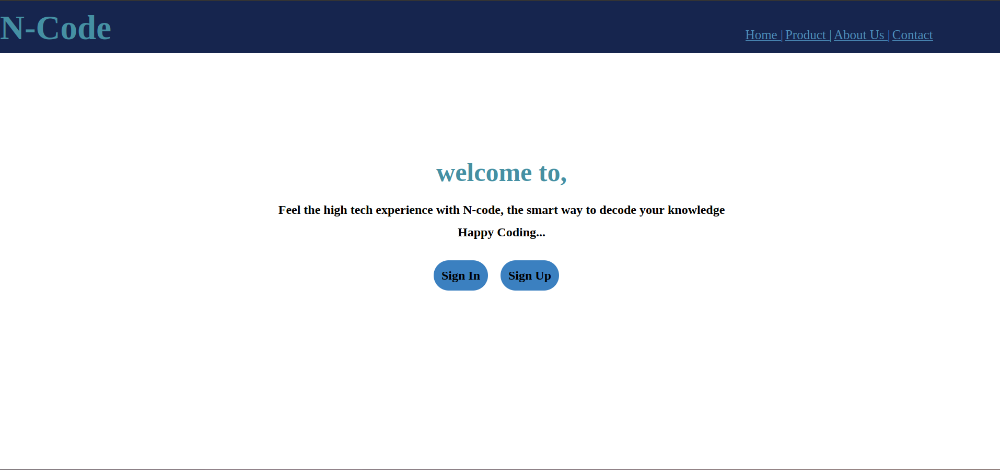
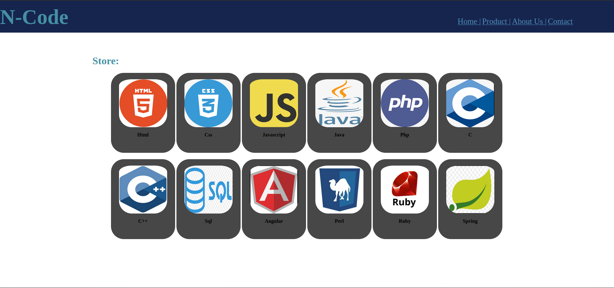
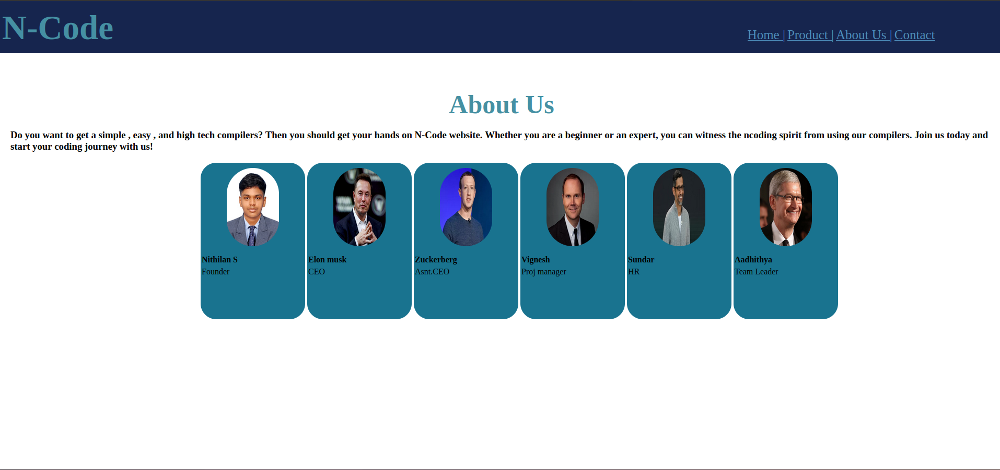
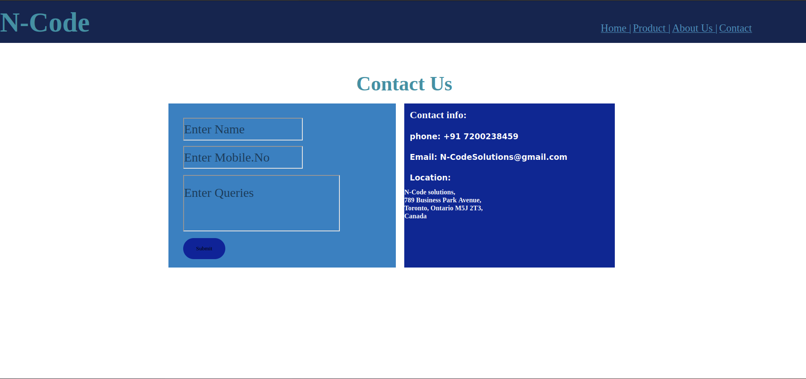

# Web Design for a Software Product Company

## AIM:

To design a static website for a software product company company.

## DESIGN STEPS:

### Step 1:

Requirement collection.

### Step 2:

Creating the layout using HTML and CSS.

### Step 3:

Updating the sample content.

### Step 4:

Choose the appropriate style and color scheme.

### Step 5:

Validate the layout in various browsers.

### Step 6:

Validate the HTML code.

### Step 6:

Publish the website in the given URL.

## PROGRAM :
### home.html:
```html
<!DOCTYPE html>
<html lang="en">
<head>
    <meta charset="UTF-8">
    <meta name="viewport" content="width=fff, initial-scale=1.0">
    <title>N-Code</title>
    <link rel="stylesheet" href="./home.css">
</head>
    <div class="header">
        <nav>
            <h1 class="name">N-Code</h1>
            <ul>
                <li><a href="home.html">Home |</a></li>
                <li><a href="product.html">Product |</a></li>
                <li><a href="about.html">About Us |</a></li>
                <li><a href="contact.html">Contact</a></li>
            </ul>
        </nav>
    </div>
    <div class="content" >
        <h1 style="text-align: center; margin-top: 200px; font-size: 50px; font-family: Georgia, 'Times New Roman', Times, serif;">welcome to,</h1>
        <h2 style="text-align: center; padding-top: 30px; font-family: Georgia, 'Times New Roman', Times, serif;">Feel the high tech experience with N-code, the smart way to decode your knowledge</h2>
        <h2 style="text-align: center; padding-top: 15px; font-family: Georgia, 'Times New Roman', Times, serif;">Happy Coding...</h2>
    </div>
    <div class="login">
        <button>Sign In</button>
        <button>Sign Up</button>
    </div>
    <div class="footer">
       <h4>Copyright &#169; 2023 N-Code Private Limited, Developed by Nithilan S</h4> 
    </div>
</body>
</html>
```
### home.css:
```css
*{
    margin: 0%;
    padding: 0%;
    font-family: Georgia, 'Times New Roman', Times, serif;
}
.header{
    background-color: rgb(22, 37, 78);
    height: 100px;
}
h1{
    color: rgb(69, 144, 163);
    margin-top: 50px;
}
ul,li{
    display: inline;
}
ul{
    margin-left: 63%;
   
}
.name{
    display: inline-block;
    margin-top: 15px;
    font-size: 65px;
    font-family: Georgia, 'Times New Roman', Times, serif;
}
a{
    font-size: 25px; 
    color: rgb(78, 144, 189);
}
a:hover{
    color: white;
    cursor: pointer;
}
.content{
    margin-top: 50px;
    
}
button{
    background-color: rgb(59, 128, 192);
    color: black;
    border: none;
    border-radius: 40px;
    padding: 15px;
    font-size: x-large;
    font-family: Georgia, 'Times New Roman', Times, serif;
    font-weight: bolder;
    margin-top: 40px;
    margin-right: 20px;
    display: inline;
}
.login{
    text-align: center;
}
button:hover{
    color: white;
    background-color: black;
}
.footer{
    background-color: black;
    color: white;
    margin-top: 465px;
    padding: 5px;
    text-align: center;
}

```
### product.html:
```html
<!DOCTYPE html>
<html lang="en">
<head>
    <meta charset="UTF-8">
    <meta name="viewport" content="width=device-width, initial-scale=1.0">
    <title>N-Code</title>
    <link rel="stylesheet" href="./product.css">
</head>
    <div class="header">
        <nav>
            <h1 class="name">N-Code</h1>
            <ul>
                <li><a href="home.html">Home |</a></li>
                <li><a href="product.html">Product |</a></li>
                <li><a href="about.html">About Us |</a></li>
                <li><a href="contact.html">Contact</a></li>
            </ul>
        </nav>
    </div>
    <div class="title">
        <h1 class="nm" style="margin-left: 10%">Store:</h1>
    </div>
    <div class="hold" style="margin-left: 18%;">
        <div class="box">
             
            <h4 style="margin-top: 10px;">Html</h4>
        </div>
        <div class="box">
            
            <h4 style="margin-top: 10px;">Css</h4>
        </div>
        <div class="box">
            
            <h4 style="margin-top: 10px;">Javascript</h4>
        </div>
        <div class="box">
            
            <h4 style="margin-top: 10px;">Java</h4>
        </div>
        <div class="box">
            
            <h4 style="margin-top: 10px;">Php</h4>
            
        </div>
        <div class="box">
            
            <h4 style="margin-top: 10px;">C</h4>
        </div>
    <br>
    <div class="box">
        
        <h4 style="margin-top: 10px;">C++</h4>
    </div>
    <div class="box" style="margin-top: 10px;">
        
        <h4 style="margin-top: 10px;">Sql</h4>
    </div>
    <div class="box">
        
        <h4 style="margin-top: 10px;">Angular</h4>
    </div>
    <div class="box">
        
        <h4 style="margin-top: 10px;">Perl</h4>
    </div>
    <div class="box">
        
        <h4 style="margin-top: 10px;">Ruby</h4>
    </div>
    <div class="box">
        
        <h4 style="margin-top: 10px;">Spring</h4>
    </div>
    </div>
</body>
</html>
```
### product.css:
```css 
*{
    margin: 0%;
    padding: 0%;
    font-family: Georgia, 'Times New Roman', Times, serif;
}
.header{
    background-color: rgb(22, 37, 78);
    height: 100px;
}
h1{
    color: rgb(69, 144, 163);
    margin-top: 50px;
}
ul,li{
    display: inline;
}
ul{
    margin-left: 63%;
}
.name{
    display: inline-block;
    margin-top: 15px;
    font-size: 65px;
    font-family: Georgia, 'Times New Roman', Times, serif;
}
a{
    font-size: 25px; 
    color: rgb(78, 144, 189);
}
a:hover{
    color: white;
    cursor: pointer;
}
.nm{
    padding-left: 5%;
    padding-top: 20px;
}
.box{
    width: 200px;
    height: 250px;
    background-color: rgb(71, 71, 71);
    text-align: center;
    border-radius: 40px;
    display: inline-block;
    margin-top: 20px; 
}
.box:hover{
    background-color: rgba(62, 87, 143, 0.342);
    color: white;
}
img{
    padding-top: 20px;
    width: 150px;
    height: 150px;
    border-radius: 40px;
}
h5{
    padding-top: 5px;
}

```
### about.html:
```html
<!DOCTYPE html>
<html lang="en">
<head>
    <meta charset="UTF-8">
    <meta name="viewport" content="width=device-width, initial-scale=1.0">
    <title>N-Code</title>
    <link rel="stylesheet" href="./about.css">
</head>
    <div class="header">
        <nav>
            <h1 class="name"></h1>
            <h1 class="name" style="color: rgb(69, 144, 163);">N-Code</h1>
            <ul>
                <li><a href="home.html">Home |</a></li>
                <li><a href="product.html">Product |</a></li>
                <li><a href="about.html">About Us |</a></li>
                <li><a href="contact.html">Contact</a></li>
            </ul>
        </nav>
    </div>
    <div class="title">
        <h1 class="abt" style="text-align: center; padding-top: 20px; font-size: 50px;">About Us</h1>
    </div>
    <div class="ctnt">
        <h3>Do you want to get a simple , easy , and high tech compilers? Then you should get your hands on N-Code website. Whether you are a beginner or an expert, you can witness the ncoding spirit from using our compilers. Join us today and start your coding journey with us!</h3>
    </div>
    <div class="people">
        <div class="ceo">
            
            <h4>Nithilan S</h4>
            <p>Founder</p>
        </div>
        <div class="ceo">
            
            <h4>Elon musk</h4>
            <p>CEO</p>
        </div>
        <div class="ceo">
            
            <h4>Zuckerberg</h4>
            <p>Asnt.CEO</p>
        </div>
        <div class="ceo">
            
            <h4>Vignesh</h4>
            <p>Proj manager</p>
        </div>
        <div class="ceo">
            
            <h4>Sundar</h4>
            <p>HR</p>
        </div>
        <div class="ceo">
            
            <h4>Aadhithya</h4>
            <p>Team Leader</p>
        </div>
    </div>
</body>
</html>
```
### about.css:
```css
*{
    margin: 0%;
    padding: 0%;
    font-family: Georgia, 'Times New Roman', Times, serif;
}
.header{
    background-color: rgb(22, 37, 78);
    height: 100px;
}
h1{
    color: rgb(69, 144, 163);
    margin-top: 50px;
}
ul,li{
    display: inline;
}
ul{
    margin-left: 63%;
}
.name{
    display: inline-block;
    margin-top: 15px;
    font-size: 65px;
    font-family: Georgia, 'Times New Roman', Times, serif;
}
a{
    font-size: 25px; 
    color: rgb(78, 144, 189);
}
a:hover{
    color: white;
    cursor: pointer;
}
.people{
    margin-left: 20%;
}
.ctnt{
    padding: 20px;
}
.ceo{
    display: inline-block;
    background-color: rgb(25, 115, 143);
    height: 300px;
    width:200px;
    border-radius: 30px;
    text-align: center;
}
h4,p{
    text-align: left;
    padding: 2px;
}
.ceo:hover{
    background-color: rgba(8, 11, 204, 0.363);
    color: white;
}
img{
    display: inline-block;
    height: 150px;
    width: 100px;
    border-radius: 60px;
    padding: 10px;
}
```
### contact.html:
```html
<!DOCTYPE html>
<html lang="en">
<head>
    <meta charset="UTF-8">
    <meta name="viewport" content="width=device-width, initial-scale=1.0">
    <title>N-Code</title>
    <link rel="stylesheet" href="./contact.css">
</head>
    <div class="header">
        <nav>
            <h1 class="name">N-Code</h1>
            <ul>
                <li><a href="home.html">Home |</a></li>
                <li><a href="product.html">Product |</a></li>
                <li><a href="about.html">About Us |</a></li>
                <li><a href="contact.html">Contact</a></li>
            </ul>
        </nav>
    </div>
    <div class="title">
        <h1>Contact Us</h1>
    </div>
    <div class="container" style="margin-left: 400px;">
        <div class="form">
        <input type="text" class="pnm" placeholder="Enter Name">
        <input type="text" class="pnm" placeholder="Enter Mobile.No"><br>
        <input type="text" class="query" placeholder="Enter Queries"><br>
        <button>Submit</button>
    </div>
    <div class="info" >
        <h2>Contact info:</h2>
        <h3>phone: +91 7200238459</h3>
        <h3>Email: N-CodeSolutions@gmail.com</h3>
        <h3>Location:</h3>
        <h4 style="margin-right: 50px;">N-Code solutions,<br>789 Business Park Avenue,<br>Toronto, Ontario M5J 2T3,<br>Canada</h4>
    </div>
    </div>
</body>
</html>
```
### contact.css:
```css
*{
    margin: 0%;
    padding: 0%;
    font-family: Georgia, 'Times New Roman', Times, serif;
}
.header{
    background-color: rgb(22, 37, 78);
    height: 100px;
}
h1{
    color: rgb(69, 144, 163);
    margin-top: 50px;
}
ul,li{
    display: inline;
}
ul{
    margin-left: 63%;
}
.name{
    display: inline-block;
    margin-top: 15px;
    font-size: 65px;
    font-family: Georgia, 'Times New Roman', Times, serif;
}
a{
    font-size: 25px; 
    color: rgb(78, 144, 189);
}
a:hover{
    color: white;
    cursor: pointer;
}
.title{
    text-align: center;
    padding: 20px;
    font-size: x-large;
}
.container{
    margin-left: 180px;
    vertical-align: top;
    display: flex;
    flex-direction: row;
}
.form{
    display: inline-block;
    height: 350px;
    width: 500px;
    background-color:  rgb(59, 128, 192);
    font-size: 50px;
    font-weight: bolder;
    padding: 20px;
}
.pnm{
    width: 280px;
    height: 50px;
    display: inline;
    margin-left: 15px;
    background-color: transparent;
}
input::placeholder{
    padding: 10px;
    font-size: 30px;
    color: black;
}
.query{
    margin-top: 15px;
    font-size: 30px;
    padding-bottom: 50px;
    height: 80px;
    margin-left: 15px;
    background-color: transparent;
}
button{
    width: 100px;
    height: 50px;
    margin-left: 15px;
    background-color: rgb(15, 35, 151);
    border-radius: 40px;
    border: none;
}
button:hover{
    background-color: rgb(36, 46, 185);
    color: white;
}
.info{
    margin-left: 20px;
    display: inline-block;
    height: 390px;
    width: 500px;
    background-color: rgb(15, 39, 146);
    color: white;
}
h2{
    padding: 13px;
}
h3{
    padding-left: 30px;
    font-family: sans-serif;
    padding: 13px;
}
p{
    margin-left: 40px;
}
h5{
    display: inline;
    margin-left: 10px;
}
```
## OUTPUT:

### Home Page:


### Product Page:


### About Page:


### Contact Page:



## Result:

Thus a website is designed for the software product company and the HTML,CSS code are validated.
